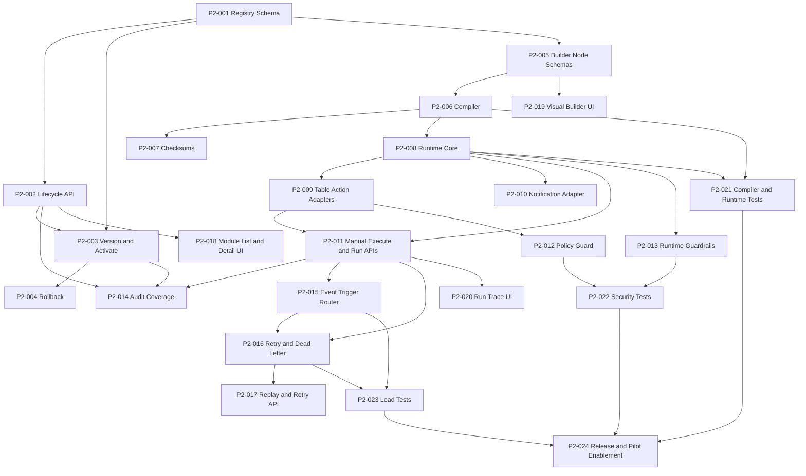

# Phase 2 Dependency DAG
## No-Code Module Capability Execution Graph

Date: 2026-04-21
Source: PHASE_2_TASK_BOARD_NO_CODE_MODULES.md

---

## 1. Dependency Map (Ticket-Level)

| Ticket | Depends On |
|---|---|
| P2-001 | None |
| P2-002 | P2-001 |
| P2-003 | P2-001, P2-002 |
| P2-004 | P2-003 |
| P2-005 | P2-001 |
| P2-006 | P2-005 |
| P2-007 | P2-006 |
| P2-008 | P2-006 |
| P2-009 | P2-008 |
| P2-010 | P2-008 |
| P2-011 | P2-008, P2-009 |
| P2-012 | P2-009 |
| P2-013 | P2-008 |
| P2-014 | P2-002, P2-003, P2-011 |
| P2-015 | P2-011 |
| P2-016 | P2-011, P2-015 |
| P2-017 | P2-016 |
| P2-018 | P2-002 |
| P2-019 | P2-005 |
| P2-020 | P2-011 |
| P2-021 | P2-006, P2-008 |
| P2-022 | P2-012, P2-013 |
| P2-023 | P2-015, P2-016 |
| P2-024 | P2-021, P2-022, P2-023 |

---

## 2. Mermaid DAG

---

## 3. Parallelization Opportunities

- Stream A: P2-001 -> P2-002 -> P2-003 -> P2-004
- Stream B: P2-005 -> P2-006 -> P2-007
- Stream C: P2-018 (after P2-002) in parallel with P2-008 backend stream
- Stream D: P2-019 (after P2-005) in parallel with compiler and runtime build
- Stream E: P2-021 and P2-020 after P2-011

---

## 4. Coordination Hotspots

- P2-006 is a gate for runtime work.
- P2-011 is a gate for triggering, run UI, and audit completion.
- P2-016 is a gate for replay and load tests.
- P2-024 is blocked by test and performance closure.